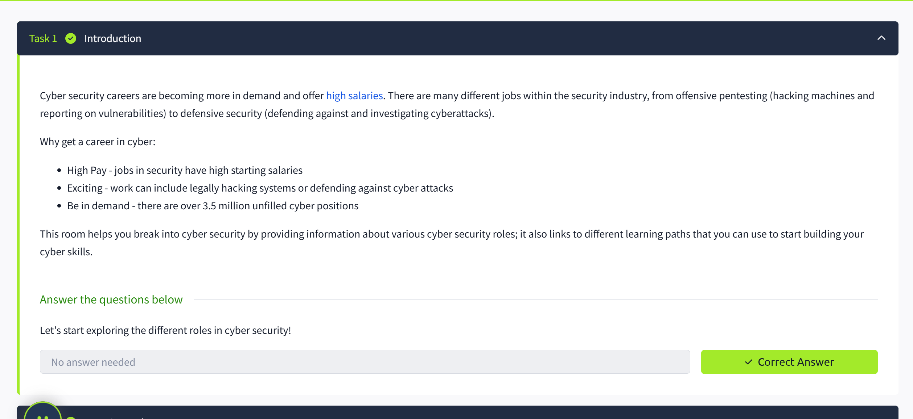
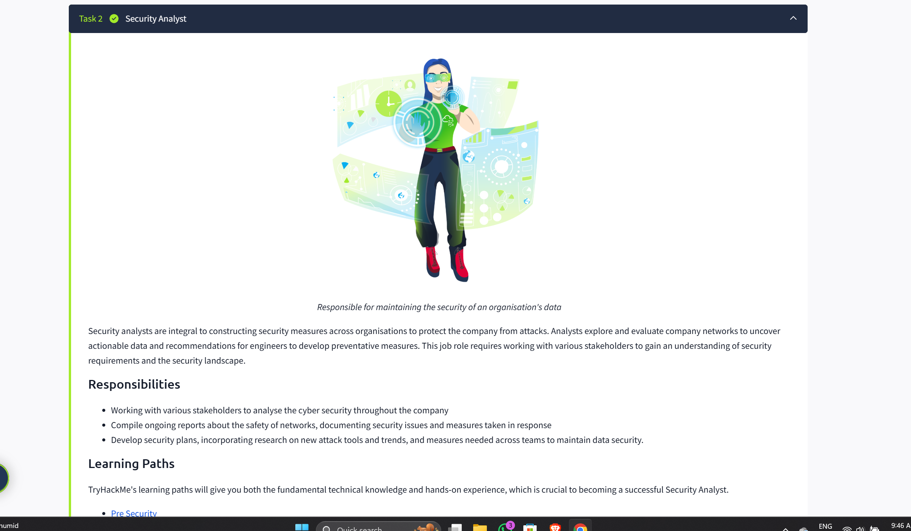
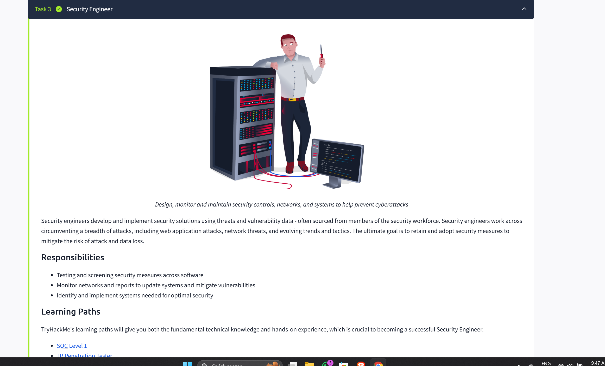
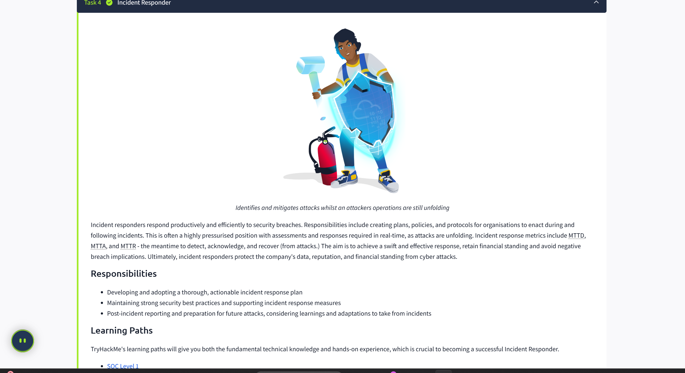
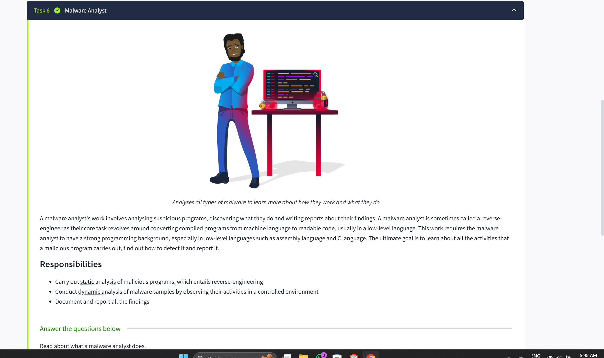
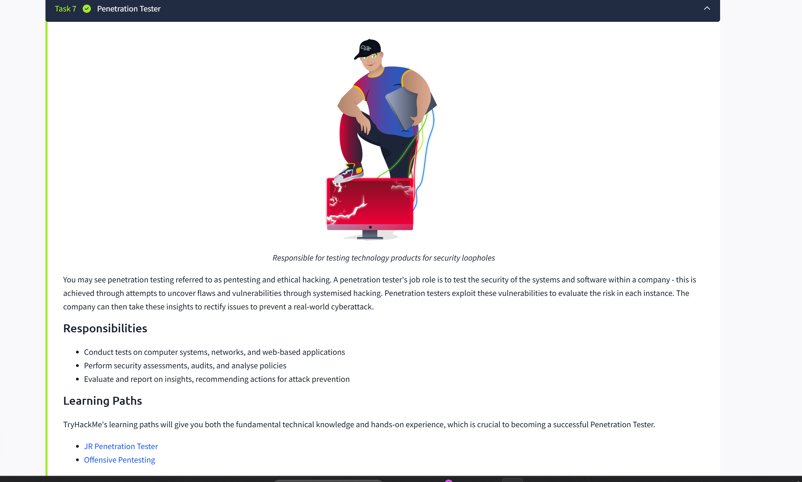
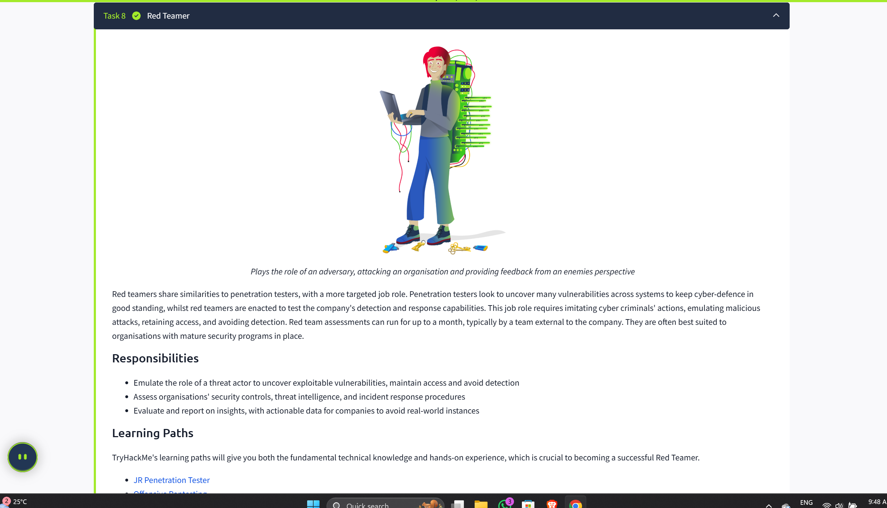

# Careers_in_Cyber

## Quick Win / Lab Overview
In this lab, I completed the TryHackMe **Careers in Cyber** room. The goal was to learn about different roles in cybersecurity, their responsibilities, and how they contribute to an organization's security.

**Key objectives:**
- Explore various cybersecurity careers.
- Understand responsibilities, skill sets, and tools for each role.
- Learn which paths align with personal interests in cyber.

---

## Tasks Completed

1. **Introduction:**  
   - Overview of cybersecurity career paths and the skills required.

2. **Security Analyst:**  
   - Monitors systems, investigates alerts, and ensures policies are followed.  

3. **Security Engineer:**  
   - Designs, implements, and maintains secure systems and networks.  

4. **Incident Responder:**  
   - Handles security incidents, minimizes impact, and restores systems.  

5. **Digital Forensics Examiner:**  
   - Investigates digital evidence to understand and reconstruct security incidents.  

6. **Malware Analyst:**  
   - Analyses malicious software, its behavior, and develops mitigation strategies.  

7. **Penetration Tester:**  
   - Performs controlled attacks to find vulnerabilities in systems and applications.  

8. **Red Teamer:**  
   - Conducts simulated attacks to test the effectiveness of defensive measures.

---

## Screenshots
- Task 1:   
- Task 2:   
- Task 3:   
- Task 4:   
- Task 5:   
- Task 6:   
- Task 7:   
- Task 8: 

---

## Lessons Learned
- Learned about the main cybersecurity roles: Analyst, Engineer, Responder, Forensics Examiner, Malware Analyst, Penetration Tester, and Red Teamer.  
- Understood daily responsibilities, tools, and skill requirements.  
- Gained insight into career paths to plan certifications and skills development accordingly.

---

## Next Steps
1. Continue with the **What is Networking?** TryHackMe room.  
2. Keep documenting all labs consistently in GitHub.  
3. Add screenshots to make the repo visually clear and professional.
