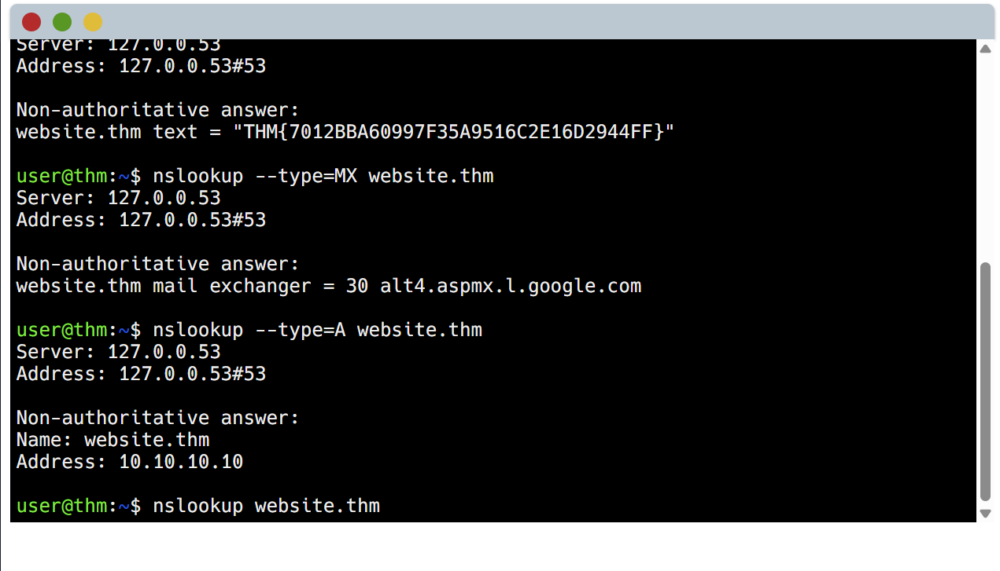
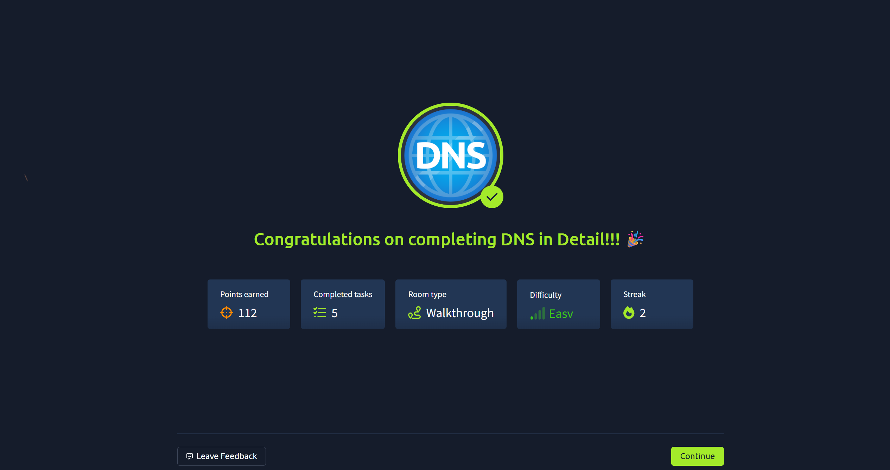
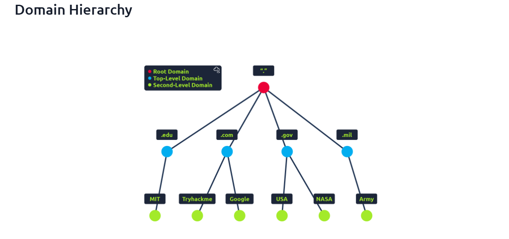

# DNS (Domain Name System) Lab

## What is DNS?
DNS (Domain Name System) is like the internet's phonebook. It converts human-friendly domain names (like tryhackme.com) into IP addresses (like 104.26.10.229), so computers can communicate over the internet without remembering complex numbers.

---

## Domain Hierarchy
1. **TLD (Top-Level Domain):**
   - Example: `.com` in `tryhackme.com`
   - Types: gTLD (generic) and ccTLD (country code)
2. **Second-Level Domain:**
   - Example: `tryhackme` in `tryhackme.com`
3. **Subdomain:**
   - Example: `admin.tryhackme.com`  
   - Can have multiple subdomains separated by dots (e.g., `jupiter.servers.tryhackme.com`)

---

## Common DNS Record Types
| Record Type | Purpose | Example |
|-------------|---------|---------|
| A           | IPv4 address mapping | 104.26.10.229 |
| AAAA        | IPv6 address mapping | 2606:4700:20::681a:be5 |
| CNAME       | Alias to another domain | store.tryhackme.com → shops.shopify.com |
| MX          | Email server | alt1.aspmx.l.google.com |
| TXT         | Text info for verification | SPF records for email |

---

## How DNS Resolution Works
When your computer wants to visit a website, this process happens:

1. **Local Cache:** Your computer checks if it already knows the IP.  
2. **Recursive DNS Server:** If not found, it asks your ISP’s DNS server.  
3. **Root DNS Servers:** Direct the request to the correct TLD server (`.com`, `.org`, etc.).  
4. **TLD Server:** Points to the authoritative server for the domain.  
5. **Authoritative DNS Server:** Returns the correct IP address.  
6. **Caching:** IP is stored locally and in the recursive server for faster future access.

**Flow Diagram:**
Client → Recursive DNS → Root Server → TLD Server → Authoritative Server → Recursive DNS → Client

---

## Key Takeaways
- DNS is essential for connecting human-readable domains to IP addresses.  
- Caching improves speed and reduces unnecessary queries.  
- Understanding DNS is fundamental for cybersecurity, networking, and troubleshooting.

---

## Screenshots

