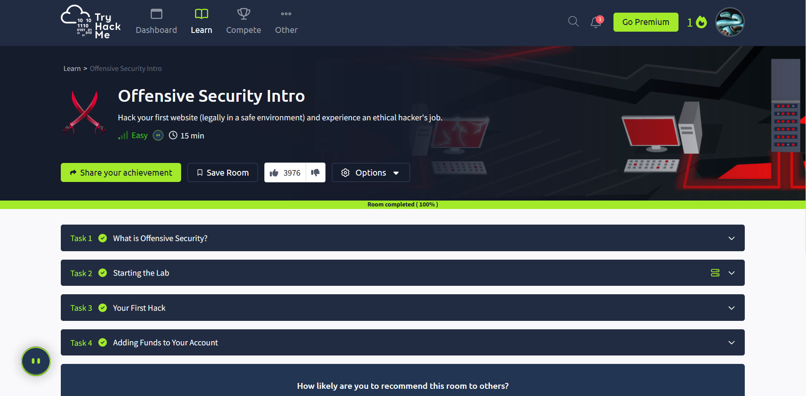
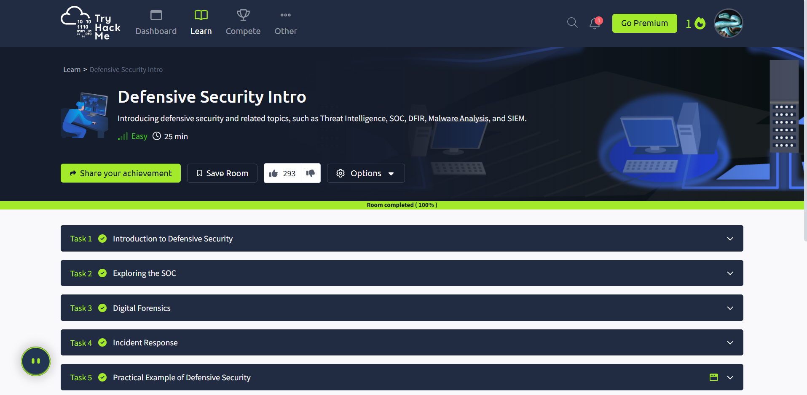
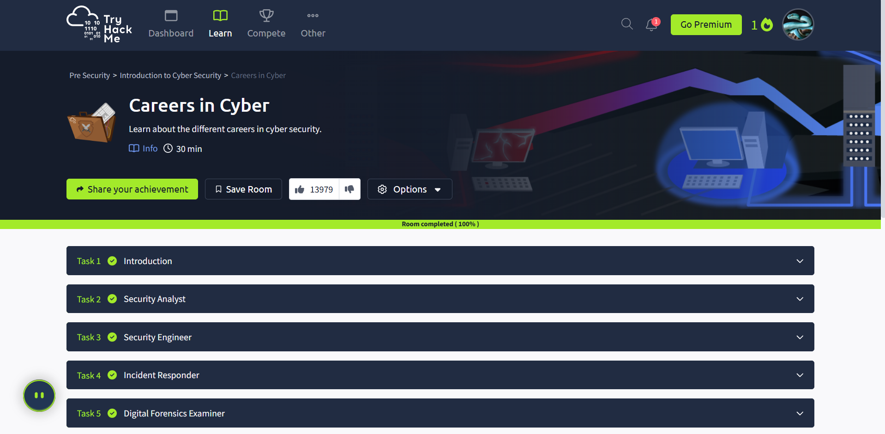

# TryHackMe: Pre-Security Path

### Goal
Complete the Pre-Security Path to learn foundational cybersecurity concepts.

### Rooms Completed
1. Offensive Security Intro
2. Defensive Security Intro
3. Careers in Cyber
4. What is Networking?

### Lessons Learned
- Understood basics of offensive and defensive security
- Learned about cybersecurity career paths
- Gained an introduction to computer networking concepts

### Screenshots
- 
- 
- 
- 

### Next Steps
- Continue Pre-Security Path on TryHackMe
- Start documenting each room with commands, notes, and screenshots
