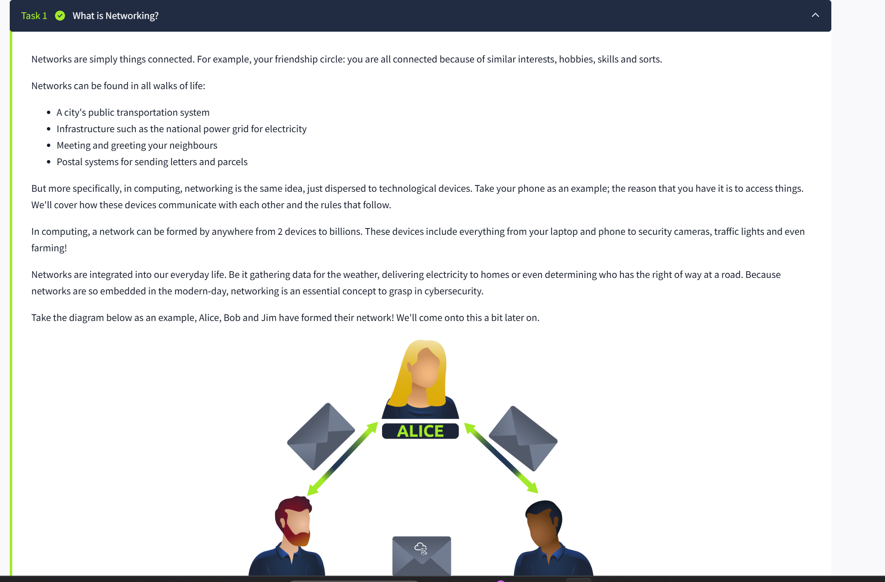
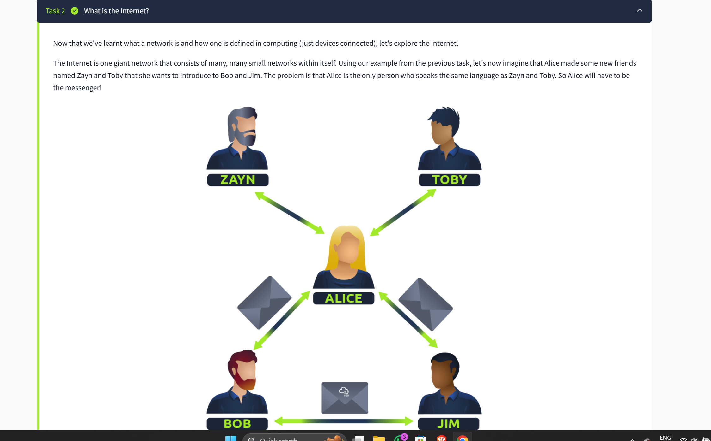
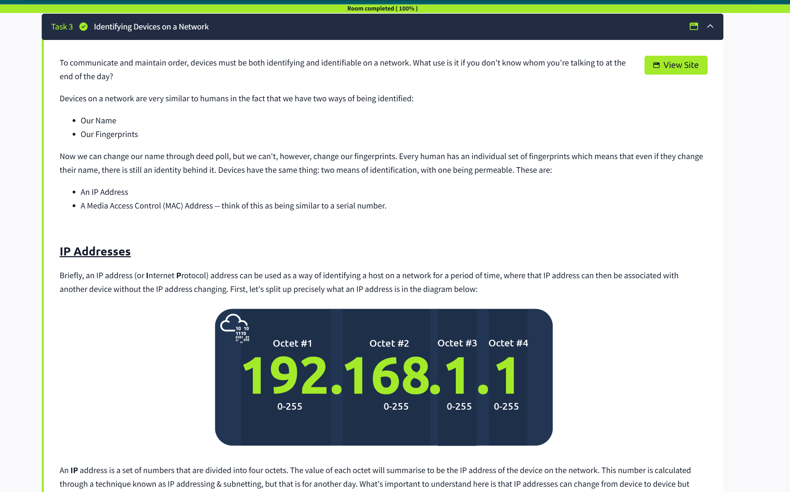
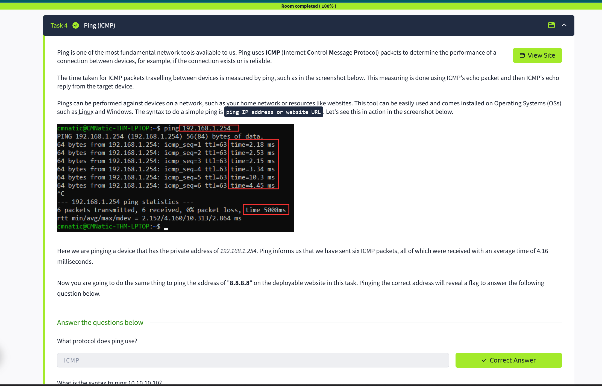

# What_is_Networking

## Quick Win / Lab Overview
In this lab, I completed the TryHackMe **What is Networking?** room. The goal was to understand basic networking concepts, IP and MAC addressing, and how devices communicate on networks.

**Key objectives:**
- Understand what a network is in computing.
- Learn about the Internet and how devices are connected.
- Explore IP addresses, MAC addresses, and network identification.
- Use basic networking tools like `ping`.

---

## Tasks Completed

### Task 1: What is Networking?
- A network is a collection of connected devices.
- Networks exist in daily life (transportation, postal systems) and in computing (phones, laptops, traffic systems).
- Key question: *What is the key term for devices that are connected together?*  
  **Answer:** Devices

### Task 2: The Internet
- Internet is a giant network connecting many smaller networks.
- Invented as ARPANET (1960s), World Wide Web by Tim Berners-Lee (1989).  
  **Answer:** Tim Berners-Lee
- Networks can be private or public.

### Task 3: IP and MAC Addresses
- Devices need identifiers:  
  - **IP Address:** Logical identifier (can be changed)  
  - **MAC Address:** Physical identifier (unique, factory-assigned)
- IP addresses can be public or private. IPv4 vs IPv6 explained.
- MAC addresses can be spoofed to bypass access restrictions.  
- Lab: Spoof MAC address in interactive simulation.  
  **Flag:** `THM{YOU_GOT_ON_TRYHACKME}`

### Task 4: Using Ping
- Ping uses **ICMP** protocol to test connectivity and latency.
- Syntax: `ping <IP address>`  
- Lab: Ping `8.8.8.8`  
  **Flag:** `THM{I_PINGED_THE_SERVER}`

---

## Screenshots
- Task 1:   
- Task 2:   
- Task 3:   
- Task 4: 

---

## Lessons Learned
- Learned the definition of a network and its importance in daily life and computing.
- Understood public vs private networks, IP and MAC addresses.
- Learned how to spoof a MAC address and use `ping` for network troubleshooting.
- Recognized the structure of the Internet and its history.

---

## Next Steps
1. Continue to **Intro to LAN** TryHackMe room.  
2. Keep documenting labs in GitHub using the same structured format.  
3. Take clear screenshots for all tasks for professional presentation.
