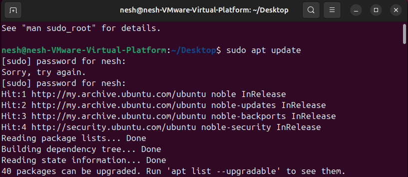
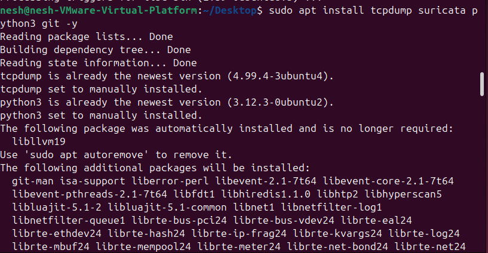
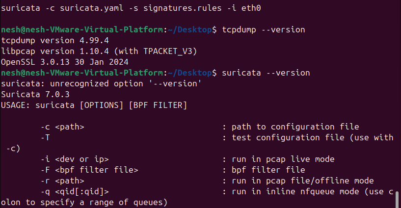
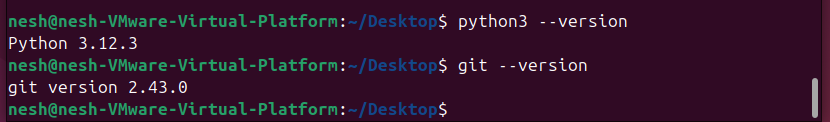

# QuickWin 1: Install Ubuntu VM + Basic Tools

### Goal
Install Ubuntu VM and essential cybersecurity tools.

### Steps Completed
1. Installed Ubuntu 22.04 LTS on VirtualBox
2. Installed basic Linux tools: tcpdump, suricata, python3, git

### Commands Used
```bash
sudo apt update
sudo apt install tcpdump suricata python3 git -y
tcpdump --version
suricata --version
python3 --version
git --version
```
### Lessons Learned
- Learned how to set up a Linux VM
- Installed and verified essential cybersecurity tools

### Screenshots












